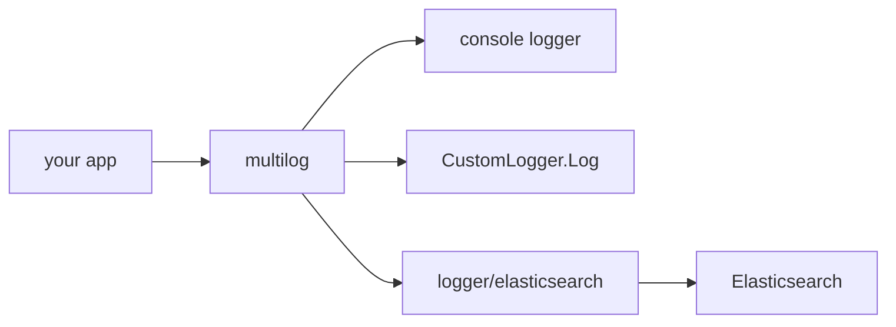
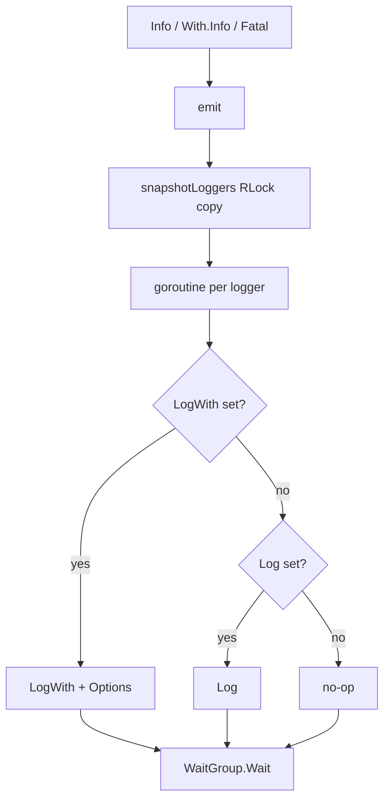
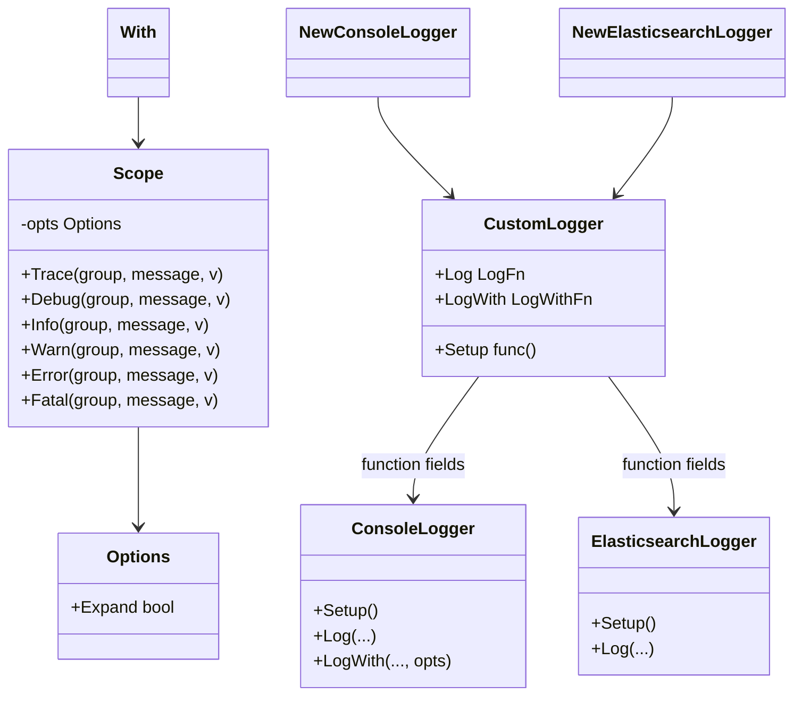
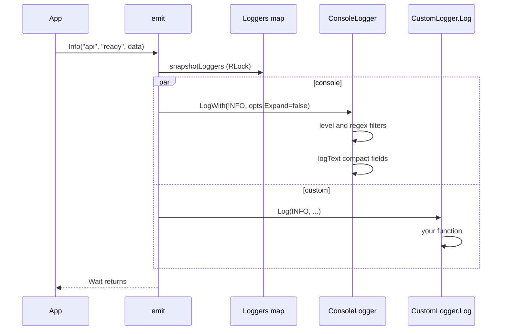

# multilog

Fan out one log call to many destinations: console, Elasticsearch, or your own logger.

Last updated: 2026-09-04

Requires Go 1.25+. Core module: `github.com/mateothegreat/multilog`. Optional shipper: `github.com/mateothegreat/multilog/logger/elasticsearch`.


## Table of contents

- Architecture
  - [Packages](#packages)
  - [Fan-out](#fan-out)
  - [Per-call options](#per-call-options)
  - [Concurrency and Fatal](#concurrency-and-fatal)
- API Reference
  - [Logging functions](#logging-functions)
  - [Registry](#registry)
  - [Console logger](#console-logger)
  - [Core types](#core-types)
  - [Elasticsearch logger](#elasticsearch-logger)
- Walkthroughs
  - [A log call through the system](#a-log-call-through-the-system)
  - [Compact vs Expand](#compact-vs-expand)
  - [Kitchen sink](#kitchen-sink)
- How-Tos
  - [Install the modules](#install-the-modules)
  - [Register a console logger](#register-a-console-logger)
  - [Add a custom logger](#add-a-custom-logger)
  - [Ship logs to Elasticsearch](#ship-logs-to-elasticsearch)
  - [Drop messages with regex filters](#drop-messages-with-regex-filters)
  - [Use slog directly](#use-slog-directly)
- [Benchmarks](#benchmarks)
- [Examples](#examples)

## Architecture

<details>
<summary><strong>Packages</strong> — Two Go modules: the core fan-out library and an optional Elasticsearch shipper.</summary>

The repo is two modules, not a monolith. Import only what you ship.

| Module                                                   | Path                   | Role                                                                   |
| -------------------------------------------------------- | ---------------------- | ---------------------------------------------------------------------- |
| `github.com/mateothegreat/multilog`                      | repo root              | Registry, log levels, `With`/`Expand`, console logger, slog helper     |
| `github.com/mateothegreat/multilog/logger/elasticsearch` | `logger/elasticsearch` | Indexes `{time, level, group, message, data}` with go-elasticsearch v8 |

The root `go.mod` uses a `replace` to `./logger/elasticsearch` for local development. Examples live under `examples/` and are not published as libraries.



**See also:** [Fan-out](#fan-out), [Install the modules](#install-the-modules)

</details>

<details>
<summary><strong>Fan-out</strong> — One package-level call snapshots the registry, then runs every logger in its own goroutine and waits.</summary>

`Trace`/`Debug`/`Info`/`Warn`/`Error`/`Fatal` all call unexported `emit`. `emit` copies `Loggers` under a read lock (`snapshotLoggers`), then starts one goroutine per logger and `WaitGroup.Wait()`s.

Dispatch rule, from `log.go`:

1. If `logger.LogWith != nil`, call `LogWith(level, group, message, v, opts)` and stop.
2. Else if `logger.Log != nil`, call `Log(level, group, message, v)`.
3. Else no-op (avoids a nil-function panic).

The console logger sets both `Log` and `LogWith`. The Elasticsearch logger and typical custom loggers set only `Log`, so they ignore `Expand`.

Each logger can still drop the line on its own: level too low (`level < args.Level`) or a drop-filter regex match on **group or message**.



**See also:** [A log call through the system](#a-log-call-through-the-system), [Concurrency and Fatal](#concurrency-and-fatal)

</details>

<details>
<summary><strong>Per-call options</strong> — Use With(...).Info(...). Package-level Info stays compact because it logs immediately.</summary>

`With(opts ...Option) Scope` builds a small value that carries `Options`. Call `Trace`/`Debug`/`Info`/`Warn`/`Error`/`Fatal` on that `Scope`.

`Expand` is the only option today. It sets `Options.Expand = true` so the console text formatter prints each field on its own line (gray `name:`, white value). Without it, fields stay on the same line as the message.

`Info(...).With(...)` is the wrong shape: package-level `Info` already called `emit` before you could attach options. Reuse a scope if many lines need the same flags:

```go
expanded := multilog.With(multilog.Expand)
expanded.Info("api", "ready", data)
expanded.Error("api", "failed", errData)
```

Nil options are skipped. JSON format and loggers without `LogWith` ignore `Expand`.

**See also:** [Logging functions](#logging-functions), [Compact vs Expand](#compact-vs-expand)

</details>

<details>
<summary><strong>Concurrency and Fatal</strong> — Calls are concurrent across loggers but synchronous to the caller. Fatal flushes 100ms then os.Exit(1).</summary>

A log call does not return until every logger's goroutine finishes. It is safe to call from many goroutines. Registration takes a write lock; snapshots take a read lock, so logging does not block other logging.

`RegisterLogger` must run from `main`/`init` in the app, not from a library `init`: import order is not guaranteed, and a duplicate name returns an error.

`Fatal` and `Scope.Fatal` share `finishFatal`: wait for `emit`, sleep 100ms (`fatalFlush`), then `os.Exit(1)` (`exitFn`). The sleep is not a delivery guarantee. `os.Exit` skips defers. Tests replace `exitFn` and `fatalFlush`.

`ResetLoggers` replaces the global map. It is for tests and must not run concurrently with log calls.

`v map[string]interface{}` is shared across logger goroutines. Do not mutate it after the call.

**See also:** [Fan-out](#fan-out), [Registry](#registry)

</details>

## API Reference

This library has no HTTP router. Tables below are the exported Go surface, extracted from the current source. Cells that do not apply are `—`.



<details>
<summary><strong>Logging functions</strong> — Package-level and Scope methods share the same arguments: group, message, and a data map.</summary>

Source: `log.go`, `options.go`.

Every function takes `group string`, `message string`, `v map[string]interface{}`. Pass `nil` for `v` if unused. Do not mutate `v` after the call.

| Function      | Compact or options         | Returns         | Errors / exit                              | Source       |
| ------------- | -------------------------- | --------------- | ------------------------------------------ | ------------ |
| `Trace`       | compact (`Options{}`)      | —               | —                                          | `log.go`     |
| `Debug`       | compact                    | —               | —                                          | `log.go`     |
| `Info`        | compact                    | —               | —                                          | `log.go`     |
| `Warn`        | compact                    | —               | —                                          | `log.go`     |
| `Error`       | compact                    | —               | —                                          | `log.go`     |
| `Fatal`       | compact                    | does not return | `finishFatal` → sleep 100ms → `os.Exit(1)` | `log.go`     |
| `With`        | `opts ...Option` → `Scope` | `Scope`         | —                                          | `options.go` |
| `Expand`      | `func(*Options)`           | —               | sets `Expand=true`                         | `options.go` |
| `Scope.Trace` | uses `Scope.opts`          | —               | —                                          | `options.go` |
| `Scope.Debug` | uses `Scope.opts`          | —               | —                                          | `options.go` |
| `Scope.Info`  | uses `Scope.opts`          | —               | —                                          | `options.go` |
| `Scope.Warn`  | uses `Scope.opts`          | —               | —                                          | `options.go` |
| `Scope.Error` | uses `Scope.opts`          | —               | —                                          | `options.go` |
| `Scope.Fatal` | uses `Scope.opts`          | does not return | same as `Fatal`                            | `options.go` |

<details>
<summary><strong>With and Expand</strong> — Variadic options, reusable Scope.</summary>

```go
multilog.With(multilog.Expand).Info("api", "ready", map[string]interface{}{
  "port": 8080,
})
```

`Option` is `func(*Options)`. `With` skips nil options. `Options` currently has one field: `Expand bool`.

</details>

**See also:** [Per-call options](#per-call-options), [Compact vs Expand](#compact-vs-expand)

</details>

<details>
<summary><strong>Registry</strong> — RegisterLogger, NewLogger, ResetLoggers, and the global Loggers map.</summary>

Source: `setup.go`.

| Function         | Arguments                             | Returns         | Errors                                                                                              | Source                                              |
| ---------------- | ------------------------------------- | --------------- | --------------------------------------------------------------------------------------------------- | --------------------------------------------------- | ---------- |
| `RegisterLogger` | `t LogMethod`, `logger *CustomLogger` | `error`         | `logger for log method %s already registered` if `t` is taken. Duplicate check runs before `Setup`. | `setup.go`                                          |
| `NewLogger`      | `t LogMethod`                         | `*CustomLogger` | —                                                                                                   | returns existing or inserts an empty `CustomLogger` | `setup.go` |
| `ResetLoggers`   | —                                     | —               | —                                                                                                   | replaces `Loggers` with a new map. Tests only.      | `setup.go` |

`RegisterLogger` inserts into `Loggers` before calling `logger.Setup`, so a `Setup` that logs recursively can see its own logger. `Setup` is skipped when it is nil.

`Loggers` is exported (`map[LogMethod]*CustomLogger`). Prefer `RegisterLogger` / `NewLogger` over writing the map yourself. `loggersMu` (`sync.RWMutex`) is unexported and guards the map.

**See also:** [Add a custom logger](#add-a-custom-logger), [Concurrency and Fatal](#concurrency-and-fatal)

</details>

<details>
<summary><strong>Console logger</strong> — NewConsoleLogger wires Setup, Log, and LogWith. Text format colorizes; JSON goes through slog.</summary>

Source: `console.go`.

| Function               | Arguments                               | Returns          | Errors                      | Source                                           |
| ---------------------- | --------------------------------------- | ---------------- | --------------------------- | ------------------------------------------------ | ------------ |
| `NewConsoleLogger`     | `*NewConsoleLoggerArgs`                 | `*CustomLogger`  | —                           | sets `Setup`, `Log`, `LogWith`                   | `console.go` |
| `NewSlogLogger`        | —                                       | `*slog.Logger`   | —                           | `PrettyHandler` on `os.Stdout`, slog level Debug | `console.go` |
| `NewPrettyHandler`     | `out io.Writer`, `PrettyHandlerOptions` | `*PrettyHandler` | —                           | wraps `slog.NewJSONHandler` plus a stdlib logger | `console.go` |
| `PrettyHandler.Handle` | `ctx context.Context`, `r slog.Record`  | `error`          | JSON marshal error of attrs | `console.go`                                     |
| `PtrString`            | `s string`                              | `*string`        | —                           | helper for `FilterDropPatterns` literals         | `util.go`    |

`NewConsoleLoggerArgs`:

| Field                | Type        | Effect                                                                                |
| -------------------- | ----------- | ------------------------------------------------------------------------------------- |
| `Level`              | `LogLevel`  | Drop when `level < Level`. Zero value is `TRACE` (0), so all levels print.            |
| `Format`             | `Format`    | `FormatText` (`"text"`) or `FormatJSON` (`"json"`)                                    |
| `FilterDropPatterns` | `[]*string` | Compiled in `Setup`. Nil entries skipped. Invalid regex: `regexp.MustCompile` panics. |

Text layout (unexported `formatFields`): keys sorted; name in RGB(158,158,158); value in `FgHiWhite`. Compact: ` name: value` on the message line. Expand: `\n  name: value` per field. Empty/nil `v` adds nothing.

JSON path uses `slog` and does not apply `Expand`. TRACE maps to slog Debug because slog has no TRACE.

Drop filters match `group` **or** `message`. A match drops the line for this logger only.

**See also:** [Register a console logger](#register-a-console-logger), [Drop messages with regex filters](#drop-messages-with-regex-filters)

</details>

<details>
<summary><strong>Core types</strong> — Levels, logger function types, and the Logger interface.</summary>

Source: `types.go`, `options.go`.

| Name                  | Kind             | Value / fields                             | Source       |
| --------------------- | ---------------- | ------------------------------------------ | ------------ |
| `TRACE`               | `LogLevel`       | `0`                                        | `types.go`   |
| `DEBUG`               | `LogLevel`       | `1`                                        | `types.go`   |
| `INFO`                | `LogLevel`       | `2`                                        | `types.go`   |
| `WARN`                | `LogLevel`       | `3`                                        | `types.go`   |
| `ERROR`               | `LogLevel`       | `4`                                        | `types.go`   |
| `FATAL`               | `LogLevel`       | `5`                                        | `types.go`   |
| `LoggerConsole`       | `LogMethod`      | `"console"`                                | `types.go`   |
| `LoggerElasticsearch` | `LogMethod`      | `"elasticsearch"`                          | `types.go`   |
| `FormatText`          | `Format`         | `"text"`                                   | `console.go` |
| `FormatJSON`          | `Format`         | `"json"`                                   | `console.go` |
| `LogFn`               | func type        | `(level, group, message, v)`               | `types.go`   |
| `LogWithFn`           | func type        | `(level, group, message, v, opts Options)` | `types.go`   |
| `LogMethod`           | `string`         | registry key                               | `types.go`   |
| `LogLevel`            | `int`            | ordered severity                           | `types.go`   |
| `Option`              | `func(*Options)` | one `With` item                            | `options.go` |
| `Options`             | struct           | `Expand bool`                              | `options.go` |
| `Scope`               | struct           | unexported `opts Options`                  | `options.go` |
| `CustomLogger`        | struct           | `Setup`, `Log`, `LogWith`                  | `types.go`   |
| `Logger`              | interface        | `Setup()`, `Log(...)`                      | `types.go`   |

`Logger` is declared and unused by the registry. Registration stores `*CustomLogger` function fields, not interface methods.

**See also:** [Logging functions](#logging-functions), [Registry](#registry)

</details>

<details>
<summary><strong>Elasticsearch logger</strong> — Separate module. Setup creates a client and may create the index. Log indexes one document.</summary>

Source: `logger/elasticsearch/elasticsearch.go`, `logger/elasticsearch/types.go`.

| Function                    | Arguments                        | Returns                  | Failure mode                                                            | Source                                     |
| --------------------------- | -------------------------------- | ------------------------ | ----------------------------------------------------------------------- | ------------------------------------------ | ------------------ |
| `NewElasticsearchLogger`    | `*NewElasticsearchLoggerArgs`    | `*multilog.CustomLogger` | —                                                                       | sets `Setup` and `Log` only (no `LogWith`) | `elasticsearch.go` |
| `ElasticsearchLogger.Setup` | —                                | —                        | `log.Fatalf` on client create, bad regex, exists-check, or index create | `elasticsearch.go`                         |
| `ElasticsearchLogger.Log`   | `level`, `group`, `message`, `v` | —                        | `log.Fatalf` on marshal or index I/O                                    | `elasticsearch.go`                         |

`NewElasticsearchLoggerArgs`:

| Field                | Type                                | Effect                                                                                  |
| -------------------- | ----------------------------------- | --------------------------------------------------------------------------------------- |
| `Level`              | `multilog.LogLevel`                 | Drop when `level < Level`                                                               |
| `Config`             | `Config` (`= elasticsearch.Config`) | go-elasticsearch v8 client config                                                       |
| `Index`              | `string`                            | Index name for exists/create/index                                                      |
| `Mapping`            | `string`                            | Body for create when the index is missing. `""` creates the index with no mapping body. |
| `FilterDropPatterns` | `[]*string`                         | Same group-or-message drop as console. Invalid regex: `log.Fatalf`                      |

`Setup` behavior:

1. `elasticsearch.NewClient(args.Config)`.
2. Compile drop patterns.
3. `Indices.Exists`. On error: `log.Fatalf`.
4. Status `404`: create with `Mapping` body if `Mapping != ""`, else create with no body.
5. Otherwise: `log.Printf("index %q already exists", index)`.

Indexed document (`ElasticsearchLog`):

| JSON field | Type                | Source                   |
| ---------- | ------------------- | ------------------------ |
| `time`     | `time.Time`         | `time.Now()` at log time |
| `level`    | `multilog.LogLevel` | call level               |
| `group`    | `string`            | call group               |
| `message`  | `string`            | call message             |
| `data`     | `any`               | `v`                      |

`DefaultMapping` is a `const` string: `time` date, `level`/`group` keyword, `message` text, `data` object.

**See also:** [Ship logs to Elasticsearch](#ship-logs-to-elasticsearch)

</details>

## Walkthroughs

<details>
<summary><strong>A log call through the system</strong> — Info snapshots the registry, fans out, then each logger filters and writes.</summary>

Assume console + a custom logger are registered. You call `multilog.Info("api", "ready", data)`.



`With(Expand).Info(...)` is the same sequence except `opts.Expand` is true, so console prints one field per line. The custom logger still gets `Log` and never sees `Options`.

**See also:** [Fan-out](#fan-out), [Compact vs Expand](#compact-vs-expand)

</details>

<details>
<summary><strong>Compact vs Expand</strong> — Default is one line. With(Expand) puts each field on its own line.</summary>

```go
data := map[string]interface{}{"foo": "foo", "bar": 1}

multilog.Info("api", "ready", data)
// [INFO] api: ready bar: 1 foo: foo

multilog.With(multilog.Expand).Info("api", "ready", data)
// [INFO] api: ready
//   bar: 1
//   foo: foo
```

Keys are sorted (`bar` before `foo`). Names are mid-gray; values are bright white. `FormatJSON` and loggers without `LogWith` do not change layout.

**See also:** [Logging functions](#logging-functions), [Kitchen sink](#kitchen-sink)

</details>

<details>
<summary><strong>Kitchen sink</strong> — examples/kitchensink registers console plus two custom loggers, then hits every level including filters and Fatal.</summary>

`examples/kitchensink/main.go` registers:

1. Console at `TRACE` / `FormatText`, drop `block_this_group` and `.*drop.*`.
2. `customerLogger1` via `RegisterLogger` with only `Log`.
3. `customerLogger2` via `NewLogger`, with `Setup` and `Log`.

Then it logs Debug (compact), Warn/Error (`With(Expand)`), Info (compact), Fatal (exits 1), and two lines that the console drop-filters. The custom loggers still print those last two because they do not implement the filters.

```bash
go run ./examples/kitchensink
```

**See also:** [Examples](#examples), [Drop messages with regex filters](#drop-messages-with-regex-filters)

</details>

## How-Tos

<details>
<summary><strong>Install the modules</strong> — go get the core; add the Elasticsearch module only if you index documents.</summary>

```bash
go get -u github.com/mateothegreat/multilog
```

If you ship to Elasticsearch:

```bash
go get -u github.com/mateothegreat/multilog/logger/elasticsearch
```

Go 1.25+ is required (`go 1.25.3` in both `go.mod` files).

**See also:** [Packages](#packages)

</details>

<details>
<summary><strong>Register a console logger</strong> — Call RegisterLogger from init or main before the first log line.</summary>

```go
func init() {
  err := multilog.RegisterLogger(multilog.LogMethod("console"), multilog.NewConsoleLogger(&multilog.NewConsoleLoggerArgs{
    Level:  multilog.TRACE,
    Format: multilog.FormatText,
  }))
  if err != nil {
    panic(err)
  }
}

func main() {
  multilog.Info("my_app", "starting up", map[string]interface{}{
    "port": 8080,
    "env":  "dev",
  })
}
```

`FormatJSON` sends through slog instead of the colorized text path. Registering the same `LogMethod` twice returns an error and does not run `Setup`.

**See also:** [Console logger](#console-logger), [Registry](#registry)

</details>

<details>
<summary><strong>Add a custom logger</strong> — Set Log on a CustomLogger. Optionally set Setup and LogWith.</summary>

```go
multilog.RegisterLogger(multilog.LogMethod("customerLogger1"), &multilog.CustomLogger{
  Log: func(level multilog.LogLevel, group string, message string, v map[string]interface{}) {
    log.Printf("logged via customerLogger1: %s: %s", group, message)
  },
})
```

Or allocate through the registry, then assign fields:

```go
logger := multilog.NewLogger(multilog.LogMethod("my_logger"))
logger.Setup = func() { /* connect */ }
logger.Log = func(level multilog.LogLevel, group string, message string, v map[string]interface{}) {
  // ship it
}
```

`NewLogger` does not call `Setup`. If you need `Setup` to run, use `RegisterLogger` instead, or call `Setup` yourself.

To honor `With(Expand)`, set `LogWith` as well. If only `Log` is set, options are ignored.

**See also:** [Registry](#registry), [Fan-out](#fan-out)

</details>

<details>
<summary><strong>Ship logs to Elasticsearch</strong> — Register the optional module with index name, client config, and optional mapping.</summary>

`Config` is an alias for [go-elasticsearch v8 Config](https://www.elastic.co/guide/en/elasticsearch/client/go-api/current/connecting.html). `Mapping` is a `string`. Pass `elasticsearch.DefaultMapping` or `""`.

```go
import (
  "crypto/tls"
  "net/http"

  "github.com/mateothegreat/multilog"
  elasticsearch "github.com/mateothegreat/multilog/logger/elasticsearch"
)

multilog.RegisterLogger(multilog.LogMethod("elasticsearch"), elasticsearch.NewElasticsearchLogger(&elasticsearch.NewElasticsearchLoggerArgs{
  Level: multilog.TRACE,
  Config: elasticsearch.Config{
    Addresses: []string{"https://localhost:9200"},
    Username:  "elastic",
    Password:  "elastic",
    Transport: &http.Transport{
      TLSClientConfig: &tls.Config{InsecureSkipVerify: true},
    },
  },
  Index:   "logs-3",
  Mapping: elasticsearch.DefaultMapping,
  FilterDropPatterns: []*string{
    multilog.PtrString(".*drop.*"),
  },
}))
```

This logger does not implement `LogWith`. `Expand` does not change the indexed document. `Setup` and `Log` call `log.Fatalf` on failure.

**See also:** [Elasticsearch logger](#elasticsearch-logger)

</details>

<details>
<summary><strong>Drop messages with regex filters</strong> — FilterDropPatterns match group or message for that logger only.</summary>

```go
multilog.NewConsoleLogger(&multilog.NewConsoleLoggerArgs{
  Format: multilog.FormatText,
  FilterDropPatterns: []*string{
    multilog.PtrString("block_this_group"),
    multilog.PtrString(".*drop.*"),
  },
})
```

`PtrString` exists because the field is `[]*string`. A match on **group or message** drops the line for that logger. Other registered loggers still receive the call unless they filter too.

Invalid patterns: console `Setup` uses `regexp.MustCompile` (panic). Elasticsearch `Setup` uses `regexp.Compile` and `log.Fatalf`.

**See also:** [Kitchen sink](#kitchen-sink), [Console logger](#console-logger)

</details>

<details>
<summary><strong>Use slog directly</strong> — NewSlogLogger is a pretty slog.Logger; NewPrettyHandler lets you pick the writer.</summary>

The console logger's JSON path and `NewSlogLogger` use `log/slog`. This is separate from `multilog.Info` fan-out.

```go
logger := multilog.NewSlogLogger()
logger.Info("hello", "key", "value")
```

`NewPrettyHandler(out, PrettyHandlerOptions{SlogOpts: ...})` if you need a writer other than stdout or different slog options. `Handle` colorizes the level, prints `[15:05:05.000]`, cyan message, and indented JSON attrs.

**See also:** [Console logger](#console-logger)

</details>

## Benchmarks

<details>
<summary><strong>Benchmarks</strong> — Fan-out cost is microseconds; your I/O dominates. Rerun on your machine.</summary>

Source: [`log_bench_test.go`](./log_bench_test.go).

```bash
go test -bench=. -benchmem -run=^$ .
```

Results from a documented run on Apple Silicon, Go 1.25, `-benchtime=100x` (numbers vary by machine):

| Benchmark                                         | ns/op | B/op | allocs/op |
| ------------------------------------------------- | ----- | ---- | --------- |
| Info, no loggers                                  | 77    | 16   | 1         |
| Info, 1 logger                                    | 939   | 116  | 4         |
| Info, 2 loggers                                   | 1305  | 217  | 6         |
| Info, 4 loggers                                   | 2796  | 443  | 10        |
| Info, 8 loggers                                   | 4358  | 837  | 18        |
| Info, concurrent (4 loggers, parallel goroutines) | 1550  | 574  | 10        |
| SnapshotLoggers (registry read + copy)            | 130   | 64   | 1         |
| Info with structured data payload                 | 1783  | 784  | 8         |

What that implies:

- Each call starts one goroutine per logger and waits. Extra loggers cost on the order of tens of bytes and a couple of allocs.
- `Info` with zero loggers is cheap. Leaving calls in unused paths is fine.
- The structured `map` is the largest alloc cost on the library side. Reuse or shrink payloads on hot paths.
- Console prints and Elasticsearch HTTP will dominate these numbers.

**See also:** [Concurrency and Fatal](#concurrency-and-fatal)

</details>

## Examples

<details>
<summary><strong>Examples</strong> — Three runnable programs under examples/.</summary>

| Example                                            | What it shows                                                              |
| -------------------------------------------------- | -------------------------------------------------------------------------- |
| [examples/kitchensink](./examples/kitchensink)     | Console + two custom loggers, compact and `With(Expand)`, filters, `Fatal` |
| [examples/dropfilters](./examples/dropfilters)     | Console drop filters + `Fatal`                                             |
| [examples/elasticsearch](./examples/elasticsearch) | Console + Elasticsearch with `DefaultMapping`                              |

```bash
go run ./examples/kitchensink
go test ./...
```

Issues and pull requests: [github.com/mateothegreat/multilog](https://github.com/mateothegreat/multilog). MIT. See [LICENSE](./LICENSE).

**See also:** [Kitchen sink](#kitchen-sink), [Install the modules](#install-the-modules)

</details>
