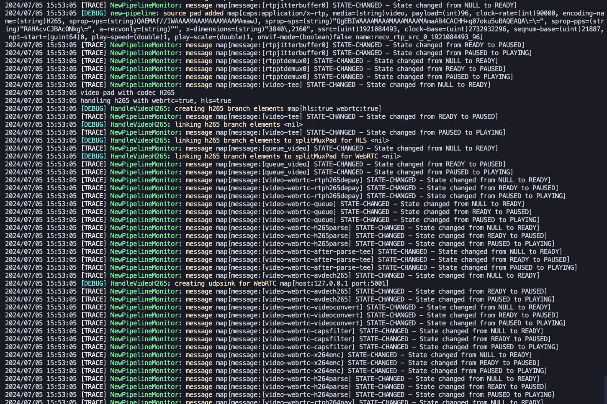

# Multilog

This package provides the ability to use multiple logging output methods simultaneously, drop messages selectively, and log structured data.

🚀 **Features**:

- Multiple logging destinations.
- Logger filtering individually.
- Structured logging.
- Log level filtering (including `TRACE` support in the console logger).
- Create Elasticsearch indexes on the fly.

🧑‍🏫 **Examples**

- [Kitchensink](../examples/kitchensink/main.go)
- [Drop filters](../examples/dropfilters/main.go)

🥡 **Included Loggers**:

- **Console**  
- **Elasticsearch** 

## Installing

```bash
go get -u github.com/mateothegreat/multilog
```

The Elasticsearch logger lives in its own submodule and is imported separately:

```bash
go get -u github.com/mateothegreat/multilog/logger/elasticsearch
```

## Concurrency semantics

Logging is **concurrent but synchronous**: each call to `Trace`/`Debug`/`Info`/`Warn`/`Error`/`Fatal`
fans out to all registered loggers in separate goroutines, then blocks until every logger has
finished. It is safe to call from multiple goroutines, but a log call does not return until all
loggers complete.

`Fatal()` waits for all loggers to complete, then sleeps 100ms as a best-effort flush for buffered
backends before calling `os.Exit(1)`. This is **not** a delivery guarantee.

## Log function signatures

All log functions take a `map[string]interface{}` as the data parameter:

```go
func Trace(group string, message string, v map[string]interface{})
func Debug(group string, message string, v map[string]interface{})
func Info(group string, message string, v map[string]interface{})
func Warn(group string, message string, v map[string]interface{})
func Error(group string, message string, v map[string]interface{})
func Fatal(group string, message string, v map[string]interface{})
```

## Defining a custom logger

```go
package main

import (
	"crypto/tls"
	"log"
	"net/http"

	"github.com/mateothegreat/multilog"
	elasticsearch "github.com/mateothegreat/multilog/logger/elasticsearch"
)

func init() {
	multilog.RegisterLogger(multilog.LogMethod("console"), multilog.NewConsoleLogger(&multilog.NewConsoleLoggerArgs{
		Format: multilog.FormatText,
		FilterDropPatterns: []*string{
			multilog.PtrString("block_this_group"),
			multilog.PtrString(".*drop.*"), // Drop any message that contains the word "drop"
		},
	}))

	multilog.RegisterLogger(multilog.LogMethod("elasticsearch"), elasticsearch.NewElasticsearchLogger(&elasticsearch.NewElasticsearchLoggerArgs{
		Config: elasticsearch.Config{ // Alias for go-elasticsearch v8 Config.
			Addresses: []string{"https://localhost:9200"},
			Username:  "elastic",
			Password:  "elastic",
			Transport: &http.Transport{
				TLSClientConfig: &tls.Config{
					InsecureSkipVerify: true,
				},
			},
		},
		Index:   "logs-3",
		Mapping: elasticsearch.DefaultMapping, // Or a custom mapping string; "" creates the index without a mapping.
		FilterDropPatterns: []*string{
			multilog.PtrString(".*drop.*"), // Drop any message that contains the word "drop"
		},
	}))

	multilog.RegisterLogger(multilog.LogMethod("customerLogger1"), &multilog.CustomLogger{
		Log: func(level multilog.LogLevel, group string, message string, v map[string]interface{}) {
			log.Printf("logged via customerLogger1: %s: %s", group, message)
		},
	})

	// Register a custom logger:
	customLogger1 := multilog.NewLogger(multilog.LogMethod("customerLogger2"))
	// If needed, you can do stuff here when the logger is setup such as
	// connecting to something like elasticsearch or whatever:
	customLogger1.Setup = func() {
		log.Println("Setup customerLogger2")
	}
	// Define the log method:
	customLogger1.Log = func(level multilog.LogLevel, group string, message string, v map[string]interface{}) {
		log.Printf("logged via customerLogger: %s: %s", group, message)
	}
}

func main() {
	multilog.Debug("my_package_name", "test", map[string]interface{}{
		"foo": "foo",
		"bar": 1,
	})
	multilog.Warn("my_package_name", "it's about to explode...", map[string]interface{}{
		"foo": "boom",
		"bar": 1234234234234,
	})

	multilog.Error("my_package_name", "some error!", map[string]interface{}{
		"foo": "bad things happened bro",
		"bar": 123,
	})

	multilog.Trace("my_package_name", "some verbose info..", map[string]interface{}{
		"foo": "it's happpeeennning!!!",
		"bar": 234234234,
	})

	multilog.Trace("nobody_cares_about_this", "this message will get dropped by the filters", nil)
	multilog.Error("block_this_group", "this message will get dropped by the filters", nil)
}
```
